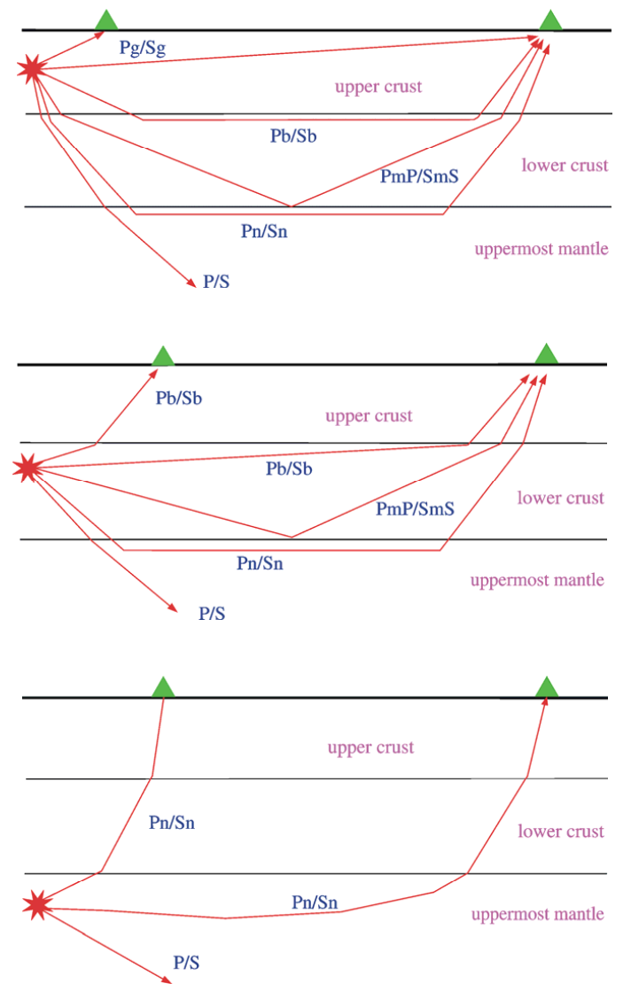

地壳震相
========

- **Pg**：在近场，上地壳震源产生的上行 P 波或在上地壳折返的 P 波。也可表示在更大震中距处，
  整个地壳内部多次 P 波混响产生的地震波，群速度约为 5.8 km/s。
- **Pb**：也叫 P*，下地壳震源产生的上行 P 波或在下地壳折返的 P 波。
- **Pn**：在上地幔顶部折返的任何 P 波或上地幔顶部震源产生的上行 P 波
- **PmP**：Moho 不连续面的上界面反射 P 波

- **Sg**：在近场，上地壳震源产生的上行 S 波或在上地壳折返的 S 波。也可表示在更大震中距处，
  整个地壳内部多次 S 波混响与 SV-P 和/或 P-SV 转换的叠加而产生的地震波。
- **Sb**：也称 S*，下地壳震源产生的上行 S 波或在下地壳折返的 S 波。
- **Sn**：在上地幔顶部折返的任何 S 波或上地幔顶部震源产生的上行 S 波
- **SmS**：Moho 不连续面的上界面反射 S 波

   常见地壳震相的几何路径

.. figure:: fig4.14-introduction-to-seismology.png
   :alt: 地壳震相的几何路径和曲线
   :width: 95.0%
   :align: center

   常见地壳震相的几何路径和走时曲线

参考文档
--------

- `IASPEI standard phase list <http://www.isc.ac.uk/standards/phases/>`__
- `The IASPEI standard nomenclature of seismic phases <https://gfzpublic.gfz-potsdam.de/rest/items/item_152435/component/file_152589/content>`__